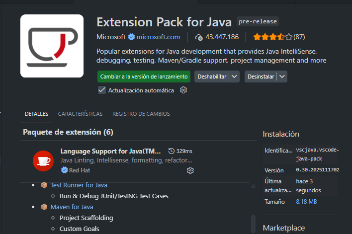
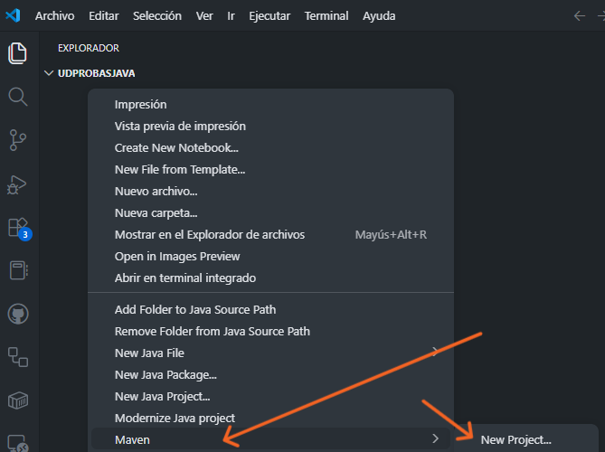
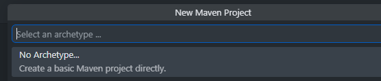
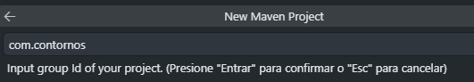
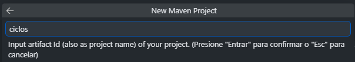
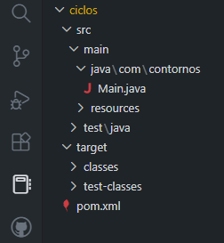
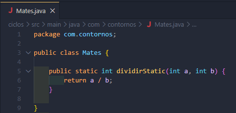
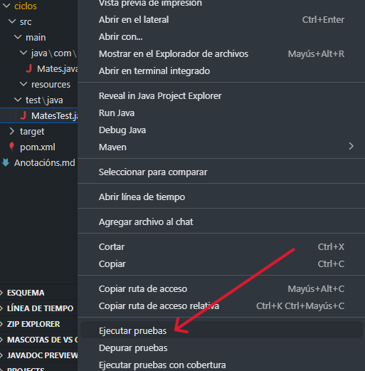
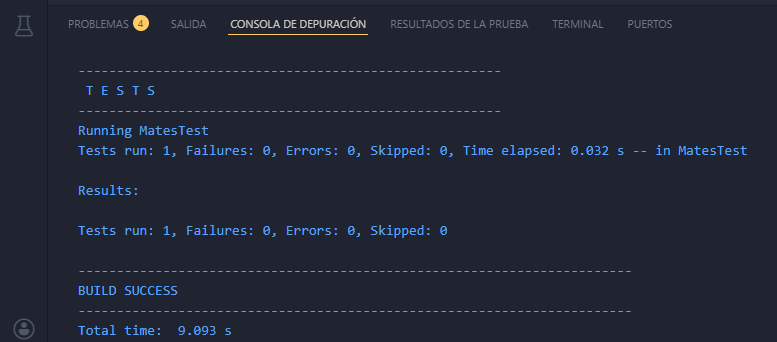

# JUnit en Java

## Consulta
[Páxina oficial de JUnit](https://junit.org)
[Páxina de VSCode](https://code.visualstudio.com/docs/java/java-testing)
[Páxina oficial de Java Brains](https://javabrains.thinkific.com)

Java Brains
[Sinxelo](https://luisrrleal.com/blog/instalar-junit-para-pruebas-de-java-en-visual-studio-code)

## Instalación
Asegúrome de que teño

## Usando Maven seguindo a Java Brains
No Explorador  de VSCode no botón da dereita _Maven/New Project.._

Escollo proxecto _No Archetype... Create a basic Maven project_

No Id do proxecto puxen: *com.contornos*
 será o nome da carpeta (artifactId)
Non chamo _demo_ Con id: _ciclos_
 
Tal cual  _Select destination folder_
 Obteño:
 

O meu primeiro código:

Pode que precise modificar _pom.xml_

