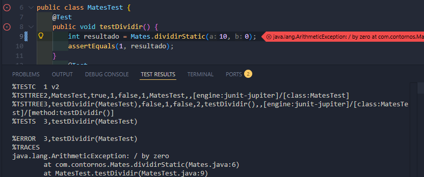
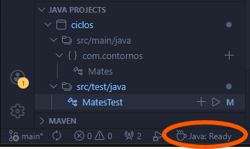

# JUnit en Java con Maven
[Ver o que falamos de JUnit noso blog](https://irocho.wordpress.com/tag/junit/)
## Instalación
Asegúrome de que teño Java e tamén:

## Creamos proxecto Maven
No Explorador  de VSCode no botón da dereita _Maven/New Project.._

Escollo proxecto _No Archetype... Create a basic Maven project_

No Id do proxecto puxen: *com.contornos*

 será o nome da carpeta (artifactId)

Non chamo _demo_ Con id: _ciclos_

Tal cual  _Select destination folder_
Obteño:

 

> Pode que precise modificar _pom.xml_

Para executar en VSCode:

Obteño algo así como:

ou ben:

## Codespaces
Lembrar que en Codespaces precisamos:

## Consulta
- [Páxina oficial de JUnit](https://junit.org)

- [Páxina de VSCode](https://code.visualstudio.com/docs/java/java-testing)

- [Páxina de Java Brains](https://javabrains.thinkific.com)

- [Instalación sinxela](https://luisrrleal.com/blog/instalar-junit-para-pruebas-de-java-en-visual-studio-code)
